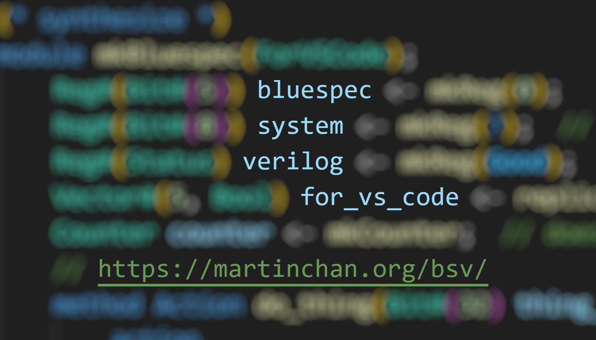
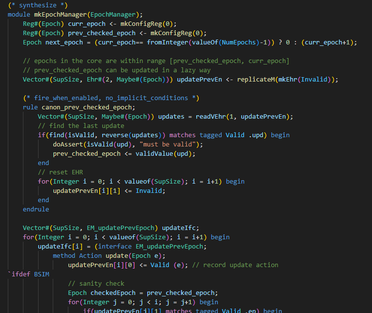
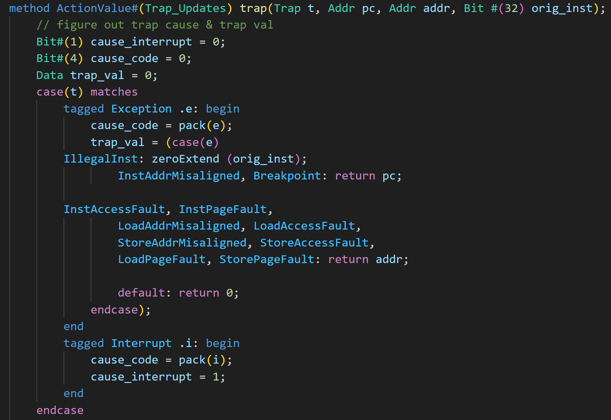
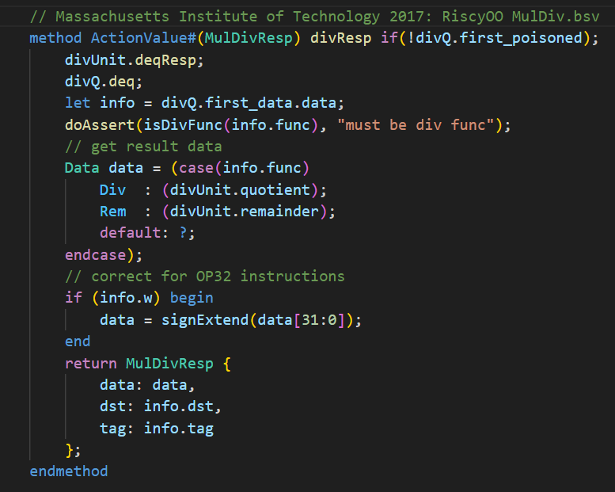
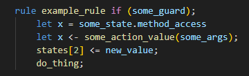
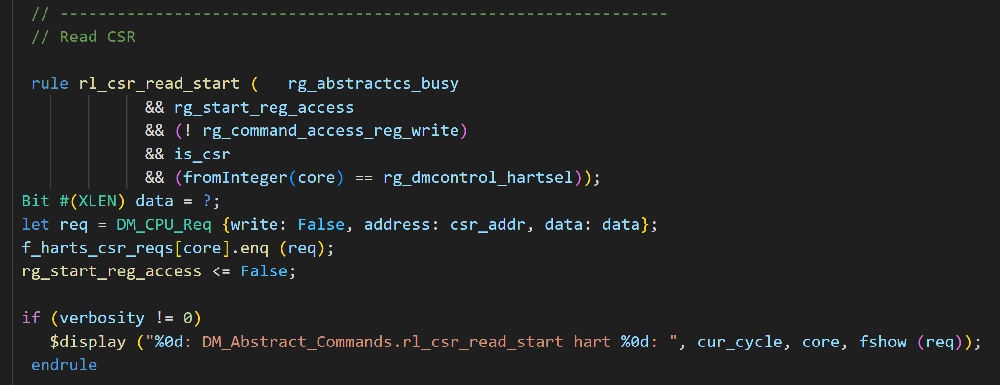
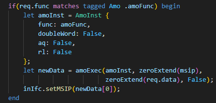

# Bluespec for VS Code

This extension for VS Code offers high-quality syntax highlighting for Bluespec and Minispec on par with syntax highlighting for mainstream languages.

Suitable for all Bluespec use cases, including research, education, and industry.

Check out my other work at https://martinchan.org/.

Not affiliated with Bluespec Inc.

## Features
> All examples below use excerpts from the [MIT RiscyOO/Bluespec Toooba](https://github.com/bluespec/Toooba/) open-source project.

<video src="./images/overall_demo_bluespec.mp4" controls title="Overview Demo"></video>

### Sophisticated Highlighting

Developers have long grown accustomed to the fantastic syntax highlighting available for mainstream languages like Python, C, Java, and TypeScript.

If something's worth doing, it's worth doing right. I built this extension from the ground up with an intense eye for detail and rigor. For the first time, high-quality syntax highlighting is now available for Bluespec on VS Code.

The syntax highlighting has been thoroughly tested against the most complex Bluespec available to make sure it's capable of handling whatever Bluespec you write.

The tokens have also been carefully selected to be consistent with syntax highlighting standards across languages, allowing you to reuse what you know from other programming languages.

<video src="./images/demo_enum.mp4" controls title="Enum Demo"></video>

### Action Analysis Engine

This syntax highlighter takes it one step further and distinguishes between actions and functional pieces of code, helping you debug Bluespec faster.

With one glance, you can see what portions of your Bluespec are responsible for state change, and which ones are purely functional. I also discuss the concepts underlying this [in a post about my Bluespec lexer for Rouge](https://martinchan.org/projects/bluespec-lexer/#actions-and-state-changes).

<video src="./images/assignment_demo.mp4" controls title="Action Analysis Demo"></video>

Remember that whether a method performs an `Action` is [only one part of scheduling](https://martinchan.org/projects/bluespec-lexer/#performance-and-scheduling). The Action Analysis Engine also currently only has limited support for implicit return types.

### Future Features

I'm unlikely to add new features until I find employment, and only then if I'm working in Bluespec. Here are some ideas for future features, written in more detail in the [TODO](/TODO.md).

Currently, there isn't much other than syntax highlighting. In terms of the possibilities, VS Code provides a significant number of [contribution points](https://code.visualstudio.com/api/references/contribution-points) that allow an extension developer to significantly boost the productivity of their users.

#### Snippets

Yes! We're missing many snippets beyond `for` and `if`. Send me snippets you want that aren't already in the Snippets section of the [TODO](./TODO.md/).

#### Language Server

One thing I've been eyeing is using [Bluespec Compiler](https://github.com/B-Lang-org/bsc) internals with the VS Code [language server extension framework](https://code.visualstudio.com/api/language-extensions/language-server-extension-guide) to provide useful information to the developer even before compilation. We could embed scheduling information directly into the editor.

## Background

If you're using Bluespec (or Minispec) for class, congratulations! I was first introduced to Bluespec through Daniel Sanchez's [Minispec](https://github.com/minispec-hdl/minispec/) when I took 6.004 (now 6.191) as a sophomore at MIT in Fall 2021. Then I really got into Bluespec when I took 6.192 my senior year in Spring 2023 with Arvind and the spectacular Thomas Bourgeat, who's now teaching at EPFL.

I made this extension because the available syntax highlighting for Bluespec on VS Code was [really bad](https://martinchan.org/projects/bluespec-lexer/#next-steps). I used VS Code to write Bluespec for 6.192 and a [summer project afterward](https://martinchan.org/projects/processor/).[^6.004] The syntax highlighting was only one step above nothing.

[^6.004]: When I took 6.004, I didn't know I could `ssh` from VS Code. I was only learning about `ssh` that semester and they taught us to use it in a really archaic way, so I thought I had no choice but to do everything from inside a terminal (gross!). I couldn't even use my mouse. If that's you right now, it doesn't have to be like this!

The Bluespec community is rather small, so once I gained some confidence from writing my [Bluespec lexer for Rouge](https://martinchan.org/projects/bluespec-lexer/), I took it upon myself to write a phenomenal extension for VS Code.

## Feedback

I'm interested in hearing about syntax highlighting bugs, usability issues, and snippet and feature requests. I don't know how fast I'd fix them, but I'd like to hear about them.

And if you enjoy using this extension, please drop a review or send me a message.

## See Also

- Check out my website at https://martinchan.org/
- If you use Jekyll for site generation and want to put Bluespec excerpts on your website, check out my [Bluespec lexer](https://martinchan.org/projects/bluespec-lexer/) for Rouge. I use it to render Bluespec excerpts on my website.

- If you work somewhere in the United States that uses Bluespec, please reach out and let me know what you think. I would like to hear from you.

## Known Issues

I'm unlikely to fix any issues or add any features unless I become employed (either in academia or industry) somewhere that uses Bluespec. Nevertheless, I'm tracking them just in case.

See the the [`TODO`](./TODO.md/).
